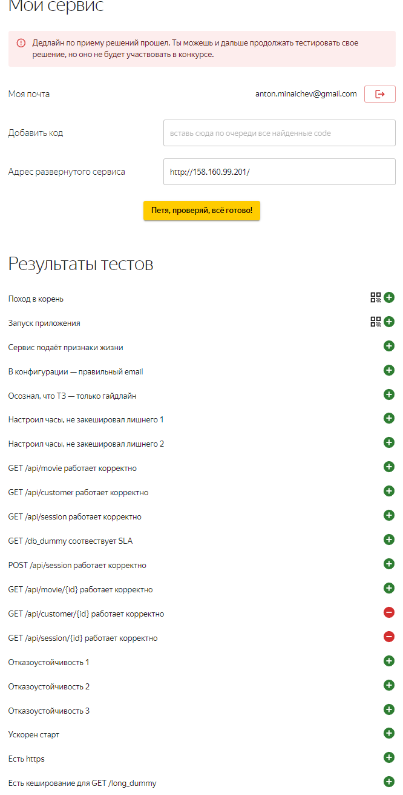

# Итоговый проект

## Готовлю инфраструктуру

Проект решил выполнить без контейнеризации, поэтому руками создал в консоле Я.Облака - 4 ВМ для 2 экземпляров приложений, БД и балансировщика, соответственно, со следующими хар-ми:

- OS: Ubuntu 22.04
- Платформа - Intel Ice Lake
- Гарантированная доля vCPU - 100%
- vCPU - 2
- RAM - 4 ГБ
- Объём дискового пространства - 50 ГБ HDD

При создании .pub ключ для SSH подключения указал. По итогу оказалось, что ROM памяти избыточно оказалось.

## Postgresql

1. Подключаемся по SSH к DB-ноде и устанавливаем postgreslq:

​	`sudo apt-get -y install postgresql`

​    Создаем новую БД и пользователя, грантуем ему права:

​    `sudo –u postgres psql`

​    `CREATE DATABASE bingo;`

​    `\c bingo`

​	`CREATE USER bingo WITH PASSWORD ‘qwerty’;*

​    `GRANT ALL PRIVILEGES ON DATABASE bingo TO bingo;`

2. Меняем *postgresql.conf*:

 listen_addresses = '*'

В pg_hba.conf добавляем строчки:

 `host  all       all       0.0.0.0/0            md5`

 `host  all       all       ::/0              md5`

## Ноды приложения

В Bingo node1/2 создаем директорию bingo в /opt, туда через wget качаем бинарник https://storage.yandexcloud.net/final-homework/bingo , через chmod +x накидываем execute права.

------

*Предварительно на локальной машине при помощи strace уже посмотрел по какому пути приложение ищет конфиг и в какой директории и с каким именем файла должны быть логи.* 

------

Создаем в директории с бинарником файл config.yaml со структурой, которую можно посмотреть запустив бинарник bingo c аргументом print_default_config, меняем адрес хоста Postgres на тот, который мы создали в прошлом пункте, креды тоже меняем. Если всё заполнили правильно – можно запускать bingo prepare_db, должен начаться процесс заполнения БД. После заполнения - можно проверить наличие таблиц на ноде БД через psql: \dt . После этого создаем .log файл по пути /opt/bongo/logs/8804b76333 (зависит от config.yaml) /main.log . 

Создаю [bingo.service](bingo.service) по пути /etc/systemd/system/bingo.service, выполняем *systemctl daemon-reload*, по пути /etc/.bingoconf создаю [.bingoconf](.bingoconf) с одним аргументом - run_server. На локальной машине столкнулся с тем, что приложение пишет очень много логов, создаю по пути /etc/logrotate.d/bingo [конфиг](bingo) для ротации логов, в кронтаб (sudo crontab -e) добавляю строку:

`*/5 * * * * /usr/sbin/logrotate -f /etc/logrotate.d/bingo` для ротации раз в 5 минут.

Перевожу bingo.service в состояние enable. Всё запускается без проблем. 

Порт, который слушается - проверил через `lsof -i`.

По локахосту через curl все эндпоинты выводятся. Теперь нужно прикрутить балансировщик.

## Балансировщик

Устанавливаю nginx, создаю файл [load-balancer.conf](load-balancer.conf) , сразу добавляю кеширование для long_dummy и https (сертификат самоподписанный), изменяю файл [nginx.conf](nginx.conf) , добавляя логирование, указывая группу кеширования. Перезапускаю nginx, с локальной машины по внешнему ip проверяю эндпоинты и в этот момент замечаю, что один раз возвращается корректная информация, а потом 'I feel bad', понимаю что произошло что-то с одной из нод приложения.

## Первая проверка и дальнейшие доработки

На самом деле первая проверка произошла сразу после настройки балансировщика, ещё без SSL и кеширования. Но результаты были не очень, 50% плюсов, основными проблемами тогда оказались `GET /api/session/{id}` и `GET /api/customer/{id}`, ну и отказоустойчивость 3. Решать начал c конца, параллельно сделав кеширование и https, с ними ничего сложного не оказалось. Ускорение старта начало отображаться после добавления в bingo.service прямое указание ресурсов. А вот убрать Отказоустойчивость 3 оказалось не совсем просто, хотя я и видел, что через n-промежуток времени сервис хоть и не умирает, но отдает только "I feel bad", решил написать скрипт-[healthcheck](hc.sh) , изначально попытался поставить его в cron, но проверка раз в минуту - не вариант, поэтому пришлось делать бесконечный цикл с проверкой раз в 5 секунд. Добавил в cron - `@reboot sh /opt/bingo/hc.sh` .

Касательно `GET /api/customer/{id}` - так и не смог победить, думал что нужно изменять postgresql.conf для увеличения ресурсов, изменял shared_buffers, temp_buffers, work_mem и прочее, но это давало изменение в 100ms максимум, и по итогу имел ~900mc latency при 400 требуемых. 

P.S. После дедлайна в ТГ чате писали, что нужно было добавить индексы к таблицам, до этого не дошёл, интересно что ещё расскажут на разборе.

## P.S.S.

Данный репозиторий создан после дедлайна, однако в ТЗ не было условий что репа должна быть создана в момент работы над проектом, после дедлайна заливаю свою README и основные файлы, которые упоминаю в отчёте, в любом случае Петя больше не проверяет, поэтому надеюсь, что попаду в перечень соревнующихся. К сожалению знаний и времени для автоматизации развертывания - не хватило. Прочитавшим спасибо! 

Итог у пети:

Написано в Typora!